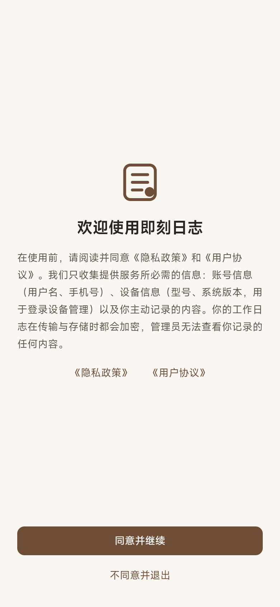
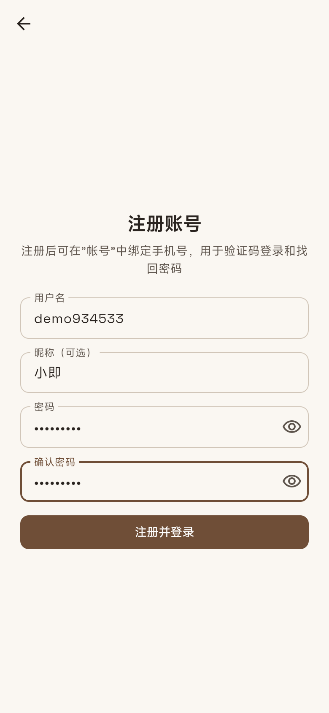
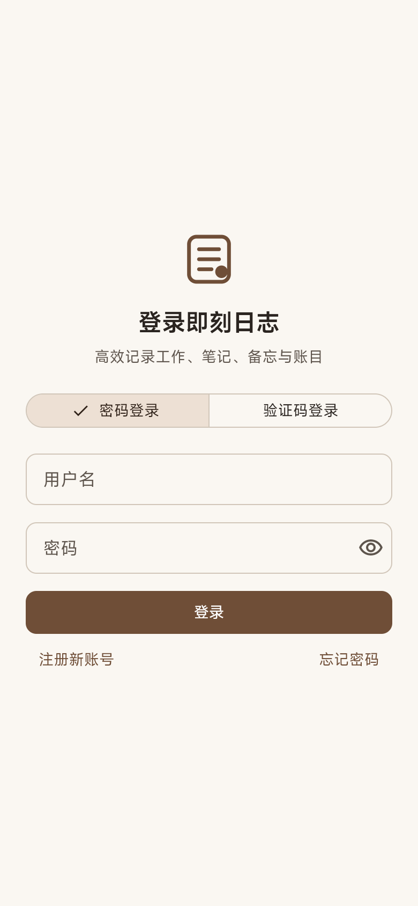

# 01 快速上手

> 适用版本：v0.2.0 及以上

## 1. 首次启动：隐私政策

首次打开即刻日志时，会先显示隐私政策与用户协议的摘要：

- 点击《隐私政策》《用户协议》可以查看全文。
- 点击 **同意并继续** 进入登录页。
- 点击 **不同意并退出** 会直接关闭应用。在你同意之前，应用不会收集任何信息，也不会初始化任何第三方组件（如推送）。

政策更新后会再次请你确认。

## 2. 注册账号

即刻日志支持两种注册方式。

### 方式一：用户名 + 密码

1. 在登录页点击 **注册新账号**。
2. 填写：
   - **用户名**：4–20 位，以字母开头，只能包含字母、数字和下划线；不区分大小写，且不能与他人重复。
   - **昵称**（可选）：最多 20 个字符，在应用里展示用。
   - **密码**：8–128 位，必须同时包含字母和数字。
3. 点击 **注册并登录**。

注册后建议在"帐号"里绑定手机号，之后就能用验证码登录和找回密码。

### 方式二：手机号验证码（自动注册）

1. 在登录页切换到 **验证码登录**，输入中国大陆手机号，点击 **获取验证码**。
2. 输入收到的 6 位验证码，点击 **登录**。
3. 如果这个手机号还没有注册，会进入 **完善注册** 页面。设置用户名和密码后即完成注册，账号会自动绑定该手机号。

完善注册需要在获取验证码后 10 分钟内完成，超时需要重新获取验证码。

## 3. 登录

| 方式 | 说明 |
|---|---|
| 密码登录 | 输入用户名和密码 |
| 验证码登录 | 输入已绑定的手机号和验证码 |

**安全限制**

- 同一账号在同一网络下连续输错密码 5 次，或在所有网络累计输错 20 次，会被锁定 15 分钟。锁定期间可以用验证码登录，验证码登录成功后锁定会解除。
- 验证码 5 分钟内有效，最多可以输错 5 次。同一手机号 60 秒内只能获取 1 次，每天最多 10 次。

## 4. 找回密码

1. 在登录页点击 **忘记密码**。
2. 输入已绑定的手机号，获取并填写验证码，再设置新密码。
3. 重置成功后，这个账号在所有设备上都会退出登录，需要用新密码重新登录。

> 为了保护隐私，即使输入的手机号没有注册，页面也会提示"验证码已发送"，只是不会真的收到短信。

## 5. 绑定或更换手机号

进入 **帐号 → 手机号**：

- **绑定**：输入当前密码和要绑定的手机号，获取验证码后确认。
- **换绑**：需要依次验证当前密码、当前手机号的验证码、新手机号的验证码。

一个手机号只能绑定一个账号。

## 6. 退出登录与注销账号

- **退出登录**：帐号页底部 → 退出登录。只会退出当前设备。
- **注销账号**：帐号页底部 → 注销账号，输入当前密码后需要再次确认。注销后，账号和全部数据会被永久删除，所有设备立即下线，**无法恢复**。如需保留数据，请先导出（v0.7.0 起提供导出功能）。
