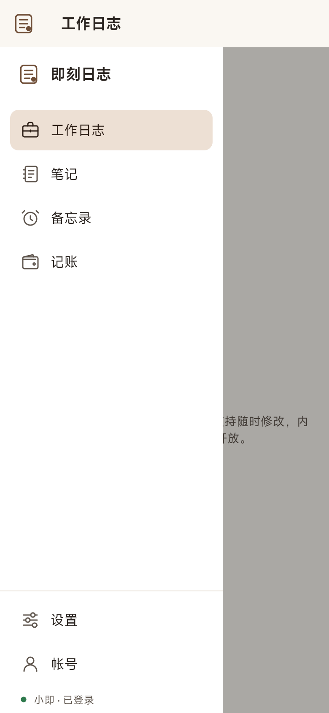
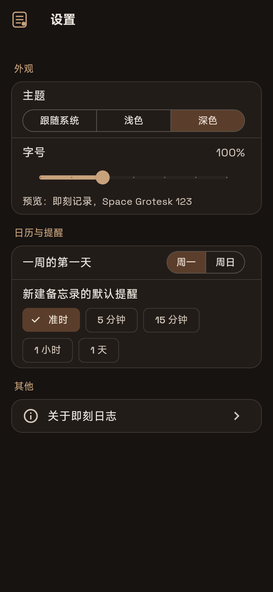
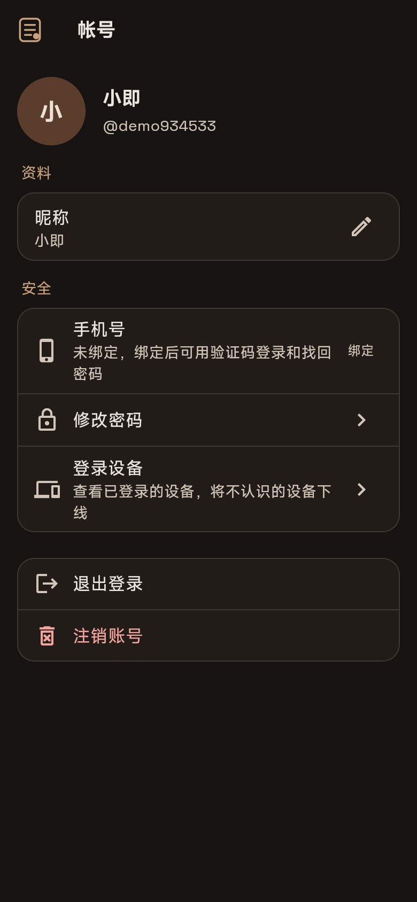

# 02 界面与导航

> 适用版本：v0.2.0 及以上

## 1. 左上角入口与侧栏

所有功能都从左侧的导航栏进入：

- **上方**：四个核心模块，依次是工作日志、笔记、备忘录、记账。点击哪个，就切换到哪个模块的主界面。
- **下方**：设置、帐号，以及当前登录状态。

屏幕宽度不同，导航栏的显示方式也不同：

| 屏幕 | 显示方式 |
|---|---|
| 手机（宽度小于 600） | 平时隐藏。点击左上角的即刻日志图标，导航栏会自上而下展开；选择入口、点击空白处或按返回键都会收起 |
| 平板竖屏、折叠屏（600–840） | 左侧常驻图标栏。点击左上角图标展开带文字的完整导航栏 |
| 平板横屏、大屏（840 以上） | 左侧常驻完整导航栏。点击左上角图标可以收起为图标栏，腾出更多内容空间 |

如果在系统设置中开启了"移除动画"或"减少动态效果"，导航栏会直接显示，不播放展开动画。

> v0.2.0 中，四个模块的主界面会说明各自将在哪个版本开放：工作日志 v0.3.0、笔记 v0.4.0、备忘录 v0.5.0、记账 v0.6.0。

## 2. 设置

进入 **导航栏 → 设置**。

| 设置项 | 说明 |
|---|---|
| 主题 | 跟随系统 / 浅色 / 深色。主色为咖色，深色主题下自动提亮以保证对比度 |
| 字号 | 80%–140%，会在系统字号的基础上叠加；拖动时下方实时预览 |
| 一周的第一天 | 周一或周日，影响日历视图（v0.5.0） |
| 新建备忘录的默认提醒 | 可多选：准时、提前 5 分钟、15 分钟、1 小时、1 天 |
| 关于即刻日志 | 版本号、隐私政策、用户协议、开源许可、字体说明 |

设置修改后立即生效，并同步到你登录的所有设备。离线时修改的设置会先保存在本机，联网后自动同步。

## 3. 帐号

进入 **导航栏 → 帐号**：

- **资料**：修改昵称。
- **手机号**：绑定或换绑，详见[快速上手](01-快速上手.md#5-绑定或更换手机号)。
- **修改密码**：可以用当前密码验证；已绑定手机号的，也可以用手机验证码验证。修改后，其他设备都需要重新登录。
- **登录设备**：列出所有已登录的设备（型号、系统、App 版本、最近活跃时间），当前设备标记为"本机"。发现不认识的设备，点击 **下线** 即可让它立即退出登录。
- **退出登录 / 注销账号**：详见[快速上手](01-快速上手.md#6-退出登录与注销账号)。

## 4. 字体

英文和数字使用 Space Grotesk，中文使用小米 MiSans。
